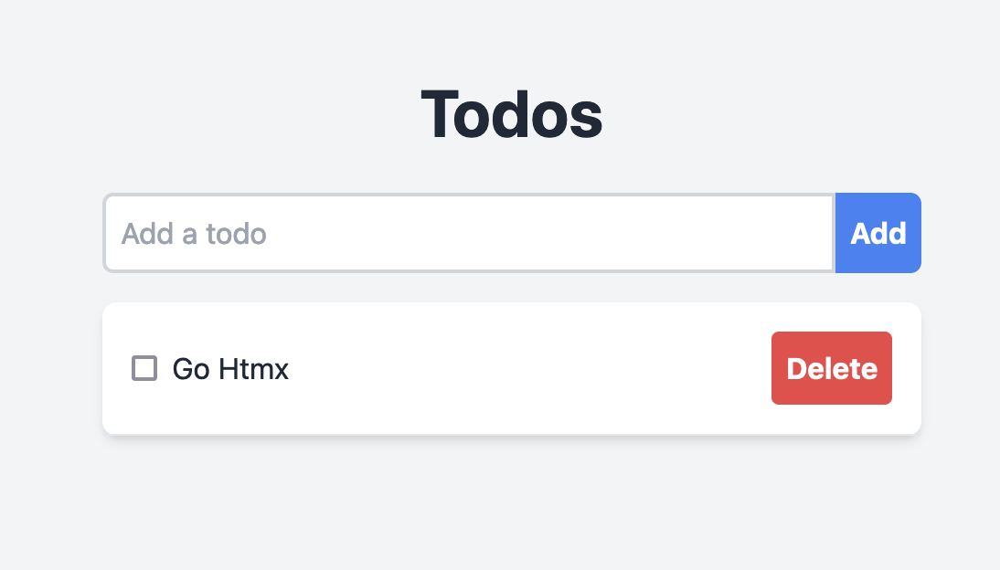

# Go Htmx Todo

This is a simple Go web application that uses the Htmx library to handle AJAX requests and update the UI in real-time.

## Installation

1. Install Go: https://golang.org/doc/install
2. Clone the repository: `git clone https://github.com/samin/go-htmx-todo.git`
3. Change into the directory: `cd go-htmx-todo`
4. Build the application: `go build`
5. Run the application: `./go-htmx-todo`

## Usage

Open your web browser and navigate to `http://localhost:3535`. You should see the initial list of todos.
